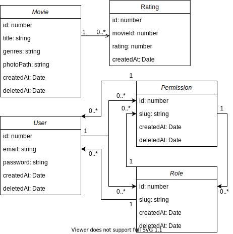

# movies-loopback

Loopback project using IMDb (Internet Movies Database). This is a POC (Proof of concept) project.

[Diagrams](https://drive.google.com/file/d/16vH-EAsPcG6YtyhrrSleIkXf1Q6xnLPF/view?usp=sharing)

## How to use ?

```
npm install
npm start

# access http://[::1]:3000/explorer/
```

## Use cases


## Classes diagrams



[-@2x.png)](http://loopback.io/)

